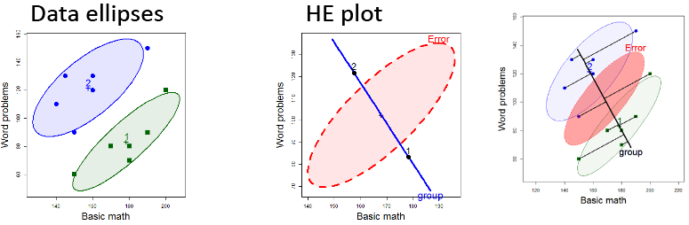

## 0: Computing set up

To follow along and run any tutorials or examples, you will need the following:

- A recent version of R, [download from here.](https://cloud.r-project.org/)
- A recent version of RStudio, [download from here.](https://rstudio.com/products/rstudio/download/#download)

- The following R packages are used:   
arm, broom, candisc, car, corrgram, dplyr, effects, ggplot2, glue, heplots, knitr, learnr, MASS, modelsummary, MVN,
mvinfluence, palmerpenguins, stargazer, rgl, rpart, rpart.plot, rstatix, tidyverse, visreg

You can install _all_ required R packages at once by running the script [install-vismlm-pkgs.R](R/install-vismlm-pkgs.R).
Alternativelty, use the following code in the R Studio console or from an editor window.

```{r eval = FALSE, echo = TRUE}
pkgs <- c("arm", "broom", "candisc", "car", "corrgram", "dplyr", "effects", "ggbiplot", 
          "ggplot2", "glue",  "heplots", "knitr", "learnr", "MASS", "modelsummary", 
          "MVN", "palmerpenguins", "stargazer", "rgl", "rpart", "rpart.plot", "rstatix",
          "tidyverse", "visreg") 

# install the above, along with any dependencies
install.packages(pkgs, dependencies=TRUE)
```


## 1: Getting started: Linear Models

<center>

</center>

### Topics:

- Why plot your data?
- Data plots 
- Effect plots 
- Diagnostic plots

### Materials: 

- **Lecture notes**: `r fontawesome::fa("file-pdf", fill="red")` [1up PDF](lectures/lecture1.pdf) || [4up PDF](lectures/lecture1-2x2.pdf) || 
  `r fontawesome::fa("video", fill="red")` 
<!-- [video](https://www.dropbox.com/s/pwac9ufsbz1r4l1/VisMLM-Lecture1.mp4?dl=0) -->
[video](https://yorku.zoom.us/rec/share/s5EdZh0EJpnRdSv-YwBRQ_UIfeRxSYT0HbjBIIpboI4Fq3hCH2pbeIOADcdNKR0E.R6Nn0XfrvsXdG2c3)

-  **Lab exercise**: `r fontawesome::fa("rocket", fill="red")` 
  + Visualizing regression models: [duncan-reg.html](exercises/duncan-reg.html) || [duncan-reg.R](exercises/duncan-reg.R)

- **Examples**: `r fontawesome::fa("laptop-code", fill="red")` 
  + Prestige data: [prestige-ex.R](examples/prestige-ex.R) || [prestige-ex.html](examples/prestige-ex.html) 
  + Penguin data: [penguins-lm-ex.R](examples/penguins-lm-ex.R) || [penguins-lm-ex.html](examples/penguins-lm-ex.html)
  + Coefficient plots: [coefplots-demo.R](examples/coefplots-demo.R) || [coefplots-demo.html](examples/coefplots-demo.html)
  + Diagnostic plots: [prestige-diagnose.R](examples/prestige-diagnose.R) || [prestige-diagnose.html](examples/prestige-diagnose.html)

###  Learning more `r fontawesome::fa("chalkboard-user", fill="red")`

- [Building better tables in R](https://themockup.blog/posts/2020-09-04-10-table-rules-in-r/) How to make tables people ACTUALY want to read.
- [How to make beautiful tables in R](https://rfortherestofus.com/2019/11/how-to-make-beautiful-tables-in-r/)
- [Visualizing Trends of Multivariate Data in R using ggplot2](https://towardsdatascience.com/visualizing-trends-of-multivariate-data-in-r-using-ggplot2-1b85409afcfb)
- [Claus Wilke, SDS 375/395 Data Visualization in R](https://wilkelab.org/SDS375/)
This is a comprehensive course in R graphics (mainly ggplot2 & friends), 
based on Wilke's [_Fundamentals of Data Visualization_](https://clauswilke.com/dataviz/).
- Effect plots are illustrated in the 
[predictor effects gallery vignette](https://cran.r-project.org/web/packages/effects/vignettes/predictor-effects-gallery.pdf)
- [Visreg:  An R package for the visualization of regression models](https://pbreheny.github.io/visreg/)
- Exploratory multivariate plots of the Palmer Penguins data
[**Penguin data: Multivariate EDA**](https://rpubs.com/friendly/penguin-biplots)


## 2: Multivariate Models

<center>

</center>

### Topics:

- Brief review of the MLM
- Data ellipses
- HEplot framework

### Materials:
- **Lecture notes**: `r fontawesome::fa("file-pdf", fill="red")`  [1up PDF](lectures/lecture2.pdf) || [4up PDF](lectures/lecture2-2x2.pdf) || `r fontawesome::fa("video", fill="red")` 
[video](https://yorku.zoom.us/rec/share/2x9weUryqUE_2BoUuG2Gz2gohNUbzYditDTQIFcZ0ETzjxpnQSXizsTZTQEHBREg.FI0Fl9SJELfQFeMd)
- **Bonus lecture**: [PCA-animation](lectures/PCA-animation.pptx)
- **Lab exercise**: `r fontawesome::fa("rocket", fill="red")`
  + Visualizing Multivariate Data: Penguins [penguins-mlm.Rmd](exercises/penguins-mlm.Rmd) Open this in R Studio & **Run Document**. 

- **Examples**: `r fontawesome::fa("laptop-code", fill="red")`
  + Math scores: Simple demo of MLMs [mathscore-simple.R]((examples/mathscore-simple.R))
  + Math scores: HE plot examples [mathscore-ex.R](examples/mathscore-ex.R) || [mathscore-ex.html](examples/mathscore-ex.html)
<!--
  + Penguins data: [penguins-he-ex.R](examples/penguins-he-ex.R) || [penguins-he-ex.html](examples/penguins-he-ex.html)
-->
  + Penguins data: [Multivariate EDA vignette](https://rpubs.com/friendly/penguin-biplots)
  + Diabetes data: [heplots and candisc examples vignette](https://cran.r-project.org/web/packages/candisc/vignettes/diabetes.html) 


### Learning more `r fontawesome::fa("chalkboard-user", fill="red")`

- Fox, Friendly & Weisberg (2013), *Hypothesis Tests for Multivariate
Linear Models Using the car Package* http://www.datavis.ca/papers/Fox+Friendly+Weisberg.pdf
- Friendly & Sigal (2017), *Graphical methods for multivariate linear models in
psychological research: An R tutorial* 
DOI: 10.20982/tqmp.13.1.p020 
http://www.tqmp.org/RegularArticles/vol13-1/p020/p020.pdf
- [**MANOVA and HE plots**](https://rpubs.com/friendly/penguin-manova) This vignette illustrates the use of MANOVA, HE plots and canonical discriminant analysis in the analysis of the Palmer penguins data.
- Friendly (2020), [**HE plot Examples**](https://cran.r-project.org/web/packages/heplots/vignettes/HE-examples.pdf)
- `heplots` package documentation, http://friendly.github.io/heplots/


## 3: Examples & Extensions

<center>

</center>

### Topics:

- MANOVA
  + Robust MLMs
- MMREG
  + Canonical correlations
  + MANCOVA and homogeneity of regression
- Homogeneity of covariance matrices

### Materials:
- **Lecture notes**: `r fontawesome::fa("file-pdf", fill="red")` [1up PDF](lectures/lecture3.pdf) || [4up PDF](lectures/lecture3-2x2.pdf) || `r fontawesome::fa("video", fill="red")` [video](https://yorku.zoom.us/rec/share/Yultmv1l9E85GQaL9IqKCHkx8vgdJsDAnSUx1YyfBXQi3HbgDIHxFI5-a0Bo7OL9._xnvnmPhB_81bpVQ)
- **Lab exercise**: `r fontawesome::fa("rocket", fill="red")`
  + Visualizing MMRA Models [rohwer-mmra.html](exercises/rohwer-mmra.html) || [rohwer-mmra.R](exercises/rohwer-mmra.R)

- **Examples**: `r fontawesome::fa("laptop-code", fill="red")`
  + Neuro Cognitive measures [NeuroCog-ex.R](examples/NeuroCog-ex.R) || [NeuroCog-ex.html](examples/NeuroCog-ex.html) 
  + Social cognition measures [SC-ex.R](examples/SC-ex.R) || [SC-ex.html](examples/SC-ex.html)
  + Rohwer MMRA data [Rohwer-MMRA-ex.R](examples/Rohwer-MMRA-ex.R) || [Rohwer-MMRA-ex.html](examples/Rohwer-MMRA-ex.html)


### Learning more `r fontawesome::fa("chalkboard-user", fill="red")`

- Friendly & Sigal (2016) *Analysis of Rohwer Data with MANCOVA*, https://rpubs.com/friendly/Rohwer-MANCOVA-ex  
- Friendly & Sigal (2018) *Visualizing Tests for Equality of Covariance Matrices* http://www.datavis.ca/papers/EqCov-TAS.pdf


